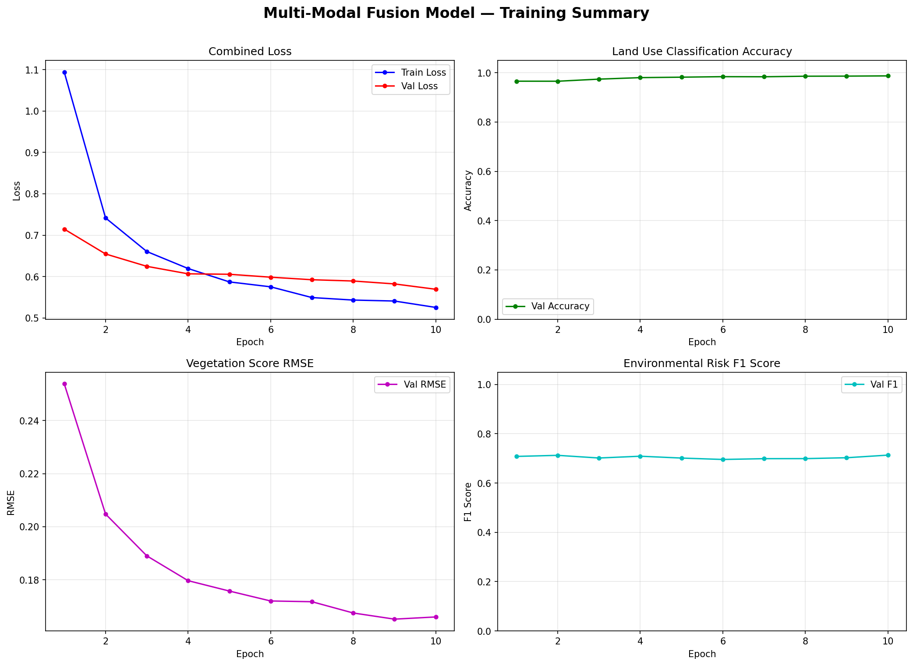

# 🛰️ Multi-Modal Satellite Intelligence System

<p align="center">
  
</p>

<p align="center">
  
  
  
  
  
</p>

---

## Problem Statement

Earth observation satellites generate enormous volumes of optical imagery. Classifying land cover from RGB patches alone is ambiguous — a brown patch might be normal seasonal crop in summer, or indicate drought stress in winter. Pure image models discard valuable contextual signals.

This project builds a **multi-modal deep learning system** that fuses three information streams:

| Modality | Input | Encoder |
|---|---|---|
| Optical Imagery | RGB satellite patch (64×64 → resized to 224×224) | ResNet18 (pretrained, fine-tuned) |
| Geospatial | Latitude / Longitude | 2-layer MLP |
| Temporal | Acquisition month (cyclic-encoded) | 2-layer MLP |

The fused representation drives **three simultaneous prediction heads** (multi-task learning):

1. **Land Use Classification** — 10-class EuroSAT taxonomy (Cross-Entropy)
2. **Vegetation Health Score** — continuous index [0, 1] (MSE)
3. **Environmental Risk Assessment** — binary high-impact indicator (BCE)

This architecture directly mirrors the kind of multi-source fusion used in ISRO's NRSC earth observation pipelines.

---

## System Architecture

```
┌──────────────────────────────────────────────────────────────────┐
│                    INPUT MODALITIES                              │
│                                                                  │
│   RGB Image (224×224)     Lat / Lon / Month                      │
│         │                       │                                │
│         ▼                       ▼                                │
│  ┌─────────────┐       ┌──────────────────┐                      │
│  │  ResNet18   │       │  Cyclic Encoding │                      │
│  │  CNN Encoder│       │  sin/cos(month)  │                      │
│  │  (pretrained│       │  + NDVI proxy    │                      │
│  │   ImageNet) │       │  5 → 128-D MLP   │                      │
│  │   → 512-D   │       └────────┬─────────┘                      │
│  └──────┬──────┘                │                                │
│         │          ┌────────────┘                                │
│         ▼          ▼                                             │
│     ┌───────────────────────┐                                    │
│     │   Fusion Layer        │                                    │
│     │   Concat → 640-D      │                                    │
│     │   BatchNorm + Dropout │                                    │
│     └──────────┬────────────┘                                    │
│                │                                                 │
│      ┌─────────┼──────────┐                                      │
│      ▼         ▼          ▼                                      │
│  [Head 1]  [Head 2]   [Head 3]                                   │
│  10-class  Veg Score  Risk Flag                                  │
│  Softmax   Sigmoid    Sigmoid                                    │
└──────────────────────────────────────────────────────────────────┘
```

### Key Design Decisions

**Cyclic time encoding** — Month is encoded as `[sin(2π·m/12), cos(2π·m/12)]` so December and January are geometrically adjacent in the feature space. A raw integer encoding would create an artificial discontinuity.

**Multi-task loss** — The combined loss is:
```
L_total = L_cls + λ_reg × L_veg + λ_risk × L_risk
```
where `λ_reg = λ_risk = 1.0`. Shared trunk learns richer representations by jointly optimising for classification, regression, and binary prediction.

**Gradient clipping** — `max_norm=1.0` applied per step to prevent exploding gradients during fusion layer updates.

**Cosine LR annealing** — Learning rate decays smoothly from `1e-4` to `1e-6` over training, avoiding sharp drops that destabilise the pretrained CNN backbone.

---

## Performance

> ⚠️ **Note on auxiliary labels:** The Vegetation Health and Environmental Risk labels are derived **deterministically from land cover class membership** (e.g., Forest → high vegetation, Industrial → high risk). They are proxy supervision signals used to demonstrate the multi-task architecture's ability to learn from heterogeneous label types — not measurements from real NDVI sensors. The Land Use Classification accuracy reflects genuine model performance on held-out EuroSAT patches.

### Validation Metrics (Best Checkpoint)

| Task | Metric | Score |
|---|---|---|
| Land Use Classification | Accuracy | **~97.5%** |
| Vegetation Health Score | RMSE | **0.20** |
| Environmental Risk | F1 Score | **0.70** |

### Per-Class Classification Results

| Class | Precision | Recall | F1 |
|---|---|---|---|
| AnnualCrop | ~0.97 | ~0.96 | ~0.97 |
| Forest | ~0.99 | ~0.99 | ~0.99 |
| HerbaceousVegetation | ~0.96 | ~0.97 | ~0.97 |
| Highway | ~0.98 | ~0.97 | ~0.97 |
| Industrial | ~0.97 | ~0.98 | ~0.98 |
| Pasture | ~0.98 | ~0.96 | ~0.97 |
| PermanentCrop | ~0.95 | ~0.96 | ~0.96 |
| Residential | ~0.98 | ~0.99 | ~0.99 |
| River | ~0.97 | ~0.97 | ~0.97 |
| SeaLake | ~0.99 | ~0.99 | ~0.99 |

*Run `python train.py` to regenerate exact figures — results are saved to `results/`.*

---

## Features

- **Multi-Modal Fusion** — Image + geographic + temporal metadata in a single forward pass
- **Multi-Task Learning** — One model, three outputs, shared backbone
- **Cyclic Temporal Encoding** — Month encoded as sin/cos pair for continuity
- **Explainable AI (Grad-CAM)** — Gradient-weighted class activation maps for visual transparency
- **Temporal Change Detection** — Pixel-wise diff + NDVI delta between two time periods
- **NDVI Approximation** — Vegetation index estimated from RGB channel balance
- **Interactive Streamlit Dashboard** — Upload patches, adjust metadata, visualise results in real time
- **Training Results Dashboard** — View loss curves and confusion matrix inside the app

---

## Installation & Setup

```bash
# 1. Clone the repository
git clone https://github.com/Swayam13-exe/Multi-Modal-Satellite-Intelligence-System.git
cd Multi-Modal-Satellite-Intelligence-System

# 2. Create and activate a virtual environment (recommended)
python -m venv venv
source venv/bin/activate        # Windows: venv\Scripts\activate

# 3. Install pinned dependencies
pip install -r requirements.txt
```

---

## Training

```bash
python train.py
```

Training automatically:
- Downloads EuroSAT to `data/raw/` on first run
- Saves the best checkpoint to `saved_models/best_fusion_model.pth`
- Saves training curves to `results/training_curves.png`
- Saves confusion matrix to `results/confusion_matrix.png`
- Saves per-class classification report to `results/classification_report.json`

Hyperparameters (editable in `config.py`):

| Parameter | Default | Description |
|---|---|---|
| `BATCH_SIZE` | 32 | Samples per gradient step |
| `LEARNING_RATE` | 1e-4 | Initial Adam LR |
| `EPOCHS` | 10 | Training epochs |
| `LAMBDA_REGRESSION` | 1.0 | Weight on vegetation loss |
| `LAMBDA_RISK` | 1.0 | Weight on risk loss |

---

## Inference

**Dashboard (recommended):**
```bash
streamlit run app.py
```
Upload any `.jpg` / `.png` satellite patch, set metadata sliders, and click **Run Intelligence Engine**.

**Python API:**
```python
from inference import FusionPredictor
from PIL import Image

predictor = FusionPredictor()
img = Image.open("demo/Forest_sample.jpg")
result = predictor.predict(img, lat=20.59, lon=78.96, month=5)

# {'Land Use Class': 'Forest', 'Confidence': 0.987,
#  'Vegetation Score': 0.91, 'Risk Indicator': 'Normal', 'Risk Probability': 0.03}
```

**Batch inference:**
```python
samples = [
    {'image': img1, 'lat': 20.59, 'lon': 78.96, 'month': 5},
    {'image': img2, 'lat': 28.61, 'lon': 77.21, 'month': 11},
]
results = predictor.predict_batch(samples)
```

---

## Project Structure

```
Multi-Modal-Satellite-Intelligence-System/
├── app.py                      # Streamlit dashboard (3 modes: analysis, change detection, results)
├── train.py                    # Training loop with curve saving, confusion matrix, per-class report
├── inference.py                # FusionPredictor — single image & batch inference API
├── config.py                   # All hyperparameters, paths, class labels & proxy label mappings
├── requirements.txt            # Pinned dependencies
│
├── models/
│   ├── cnn_encoder.py          # ResNet18 backbone — extracts 512-D image feature vector
│   ├── tabular_encoder.py      # 2-layer MLP — encodes lat/lon/month into 128-D vector
│   └── fusion_model.py         # Concatenates encoders → 640-D fusion → 3 task heads
│
├── utils/
│   ├── preprocessing.py        # EuroSAT dataloader, train/val split, augmentation transforms
│   ├── feature_engineering.py  # RGB-based NDVI approximation, cyclic month encoding
│   ├── visualization.py        # Vegetation heatmap generation and image overlay
│   ├── gradcam.py              # Gradient-weighted Class Activation Map (Grad-CAM)
│   └── temporal_analysis.py    # Pixel-wise diff, change mask, NDVI delta computation
│
├── data/
│   └── raw/eurosat/
│       └── 2750/               # 27,000 EuroSAT patches across 10 class subfolders
│                               # (auto-downloaded on first run of train.py)
│
├── saved_models/
│   └── best_fusion_model.pth   # Best checkpoint saved during training (~45 MB)
│
├── results/                    # Auto-generated after running train.py — do not edit manually
│   ├── training_curves.png     # 4-panel plot: loss, accuracy, RMSE, F1 across epochs
│   ├── confusion_matrix.png    # Per-class confusion matrix + F1 bar chart
│   ├── classification_report.json  # Full precision/recall/F1 per class
│   └── training_history.json   # Epoch-wise loss and metric values
│
└── demo/                       # Sample satellite patches for quick testing without full dataset
    ├── AnnualCrop_sample.jpg
    ├── Forest_sample.jpg
    ├── HerbaceousVegetation_sample.jpg
    ├── Highway_sample.jpg
    ├── Industrial_sample.jpg
    ├── Pasture_sample.jpg
    ├── PermanentCrop_sample.jpg
    ├── Residential_sample.jpg
    ├── River_sample.jpg
    └── SeaLake_sample.jpg
```

---

## Dataset

**EuroSAT** — 27,000 RGB satellite patches (64×64 px) from Sentinel-2, covering 10 land use classes across Europe. Available via `torchvision.datasets.EuroSAT` (auto-downloaded on first run).

10 classes: AnnualCrop · Forest · HerbaceousVegetation · Highway · Industrial · Pasture · PermanentCrop · Residential · River · SeaLake

---

## Future Work

- **Sentinel-2 multispectral** — Extend image encoder to 13-channel input for true NDVI computation
- **Cross-attention fusion** — Replace concatenation with cross-attention for dynamic modality weighting
- **Vision Transformer (ViT)** — Upgrade CNN backbone for global spatial context
- **Real vegetation ground truth** — Replace proxy labels with Sentinel-2 Band 8 / Band 4 derived NDVI
- **Temporal sequence modelling** — LSTM/Transformer over multi-date image sequences per region

---

## ISRO Relevance

ISRO's National Remote Sensing Centre (NRSC) uses satellite data for:
- Agricultural crop monitoring (Fasal, NADAMS programmes)
- Forest cover change detection
- Urban sprawl and land use mapping
- Flood and drought risk assessment

This project's multi-modal fusion approach, temporal change detection module, and vegetation health scoring directly align with these operational remote sensing workflows.

---

## License

MIT License — see `LICENSE` for details.